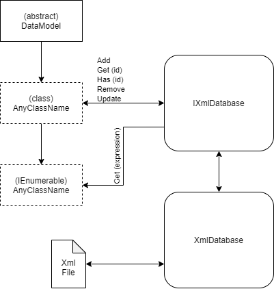
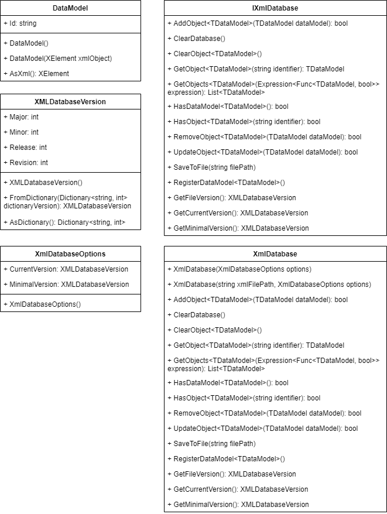

# DotNetTools.XMLDatabase
.Net Tool Library written in C# language for handling and using XML files as lightweight, portable database with minimal requirements.

This library allows to save (after registering class as data model) any Instance of class to XML file using 2 particular classes and one interface.

* ***DataModel***  
Abstract class that is required to be implemented as a parent class for a data model class that is inherited.
* ***XmlDatabase***  
Base library class worker, that allow to *Add to XML*, *Update in XML*, *Remove from XML*, *Get from XML*, *Find in XML* instances of data models inherited from *DataModel*.
* ***IXmlDatabase***  
Interface from base library class worker, that allow to implement.

## Usage Flow


## Class Diagrams


# Usage

Class that will be used as data model in XML database must be inherited from ***DataModel*** class.

## DataModel

```DataMode.DataModel()``` - Create an empty instance of data model class with generated GUID identifier.  
```DataMode.DataModel(XElement xmlObject)``` - Create an instance of data model class, filled by data from XML (XElement) object, from XML file.  
```AsXml()``` - Convert instance of data model to XML (XElement) object.

## XmlDatabase & IXmlDatabase

```XmlDatabase.XmlDatabase(XmlDatabaseOptions options = null)``` - Create new instance of XML database manager with optional options.  
```XmlDatabase.XmlDatabase(string xmlFilePath, XmlDatabaseOptions options = null)``` - Create new instance of XML database manager with optional options, and load data from XML file.  
```IXmlDatabase.AddObject<TDataModel>(TDataModel dataModel)``` - Insert new instance of data model into XML database.  
```IXmlDatabase.ClearDatabase()``` - Remove all data models instances from XML database.
```IXmlDatabase.ClearObject<TDataModel>()``` - Remove all data models instances with particular type from XML database.  
```IXmlDatabase.GetObject<TDataModel>(string identifier)``` - Get data model instance from XML database with partucular type by identifier.  
```IXmlDatabase.GetObjects<TDataModel>(Expression<Func<TDataModel, bool>> expression = null)``` - Get list od data model instances from XML database with particular type by query linq expression.  
```IXmlDatabase.HasDataModel<TDataModel>()``` - Check if XML database contains any of data model instance with particular type.  
```IXmlDatabase.HasRegisteredDataModel<TDataModel>()``` - Check if data model of particular type has been registered in XML database.  
```IXmlDatabase.HasObject<TDataModel>(string identifier)``` - Check if XML database contains data model instance with particular type and identifier.  
```IXmlDatabase.RemoveObject<TDataModel>(TDataModel dataModel)``` - Remove data model instance from XML database.  
```IXmlDatabase.UpdateObject<TDataModel>(TDataModel dataModel)``` - Update data model instance in XML database.  
```IXmlDatabase.SaveToFile(string filePath)``` - Save XML database to XML file.  
```IXmlDatabase.RegisterDataModel<TDataModel>()``` - Register particular data model class type inherited from *DataModel*.  
```IXmlDatabase.GetFileVersion()``` - Get version of loaded XML file.  
```IXmlDatabase.GetCurrentVersion()``` - Get current version of XML database library, or custom configured highest supported file version.  
```IXmlDatabase.GetMinimalVersion()``` - Get minimal supported file version, or custom configured.  

## XMLDatabaseVersion

```XMLDatabaseVersion.XMLDatabaseVersion()``` - Create new version instance.  
```XMLDatabaseVersion.FromDictionary(Dictionary<string, int> dictionaryVersion)``` - Create version instance from dictionary equivalent structure.  
```XMLDatabaseVersion.AsDictionary()``` - Convert version instance to dictionary equivalent structure.  

# Examples

## Create database with data model.
``` C#
public class MemberModel: DataModel
{
    public string FirstName { get; set; }
    public string Surname { get; set; }
    public DateTime? BirthDate { get; set; }
    public string Phone { get; set; }
    public string Email { get; set; }

    /// <summary> Required constructor for Data Model. </summary>
    public MemberModel() : base() { }

    /// <summary> Required constructor with XElement object for Data Model. </summary>
    /// <param name="xmlObject"> XML database object with data to insert inside class instance. </param>
    public MemberModel(XElement xmlObject) : base(xmlObject) { }
}

public static class Program
{
    public static void Main()
    {
        //  Create new instance of database.
        IXmlDatabase database = new XmlDatabase();

        //  Register MemberModel.
        database.RegisterDataModel<MemberModel>();

        //  Create and add new MemberModel instance into database.
        database.AddObject(new MemberModel()
        {
            FirstName = "Jan",
            Surname = "Kowalski",
            BirthDate = new DateTime(1997, 01, 01, 0, 0, 0),
            Phone = "564831927",
            Email = "jan.kowalski@example.com"
        });

        //  Save database.
        database.SaveToFile(@"C:\myXmlDatabase.xml");
    }
}
```

## Load database and save with updated data.
``` C#
public class EventModel: DataModel
{
    public string Name { get; set; }
    public string Description { get; set; }
    public DateTime Date { get; set; }

    public EventModel() : base() { }
    public EventModel(XElement xmlObject) : base(xmlObject) { }
}

public static class Program
{
    public static void Main()
    {
        //  Create instance of database and load data from file.
        IXmlDatabase database = new XmlDatabase(@"C:\myXmlDatabase.xml");

        //  Register models that will be used.
        database.RegisterDataModel<EventModel>();

        //  Get data with id: e84140d985ec4ee6878dfcde27e9f324
        var eventModel = database.GetObject<EventModel>("e84140d985ec4ee6878dfcde27e9f324");

        //  Update data.
        eventModel.Date = new DateTime(1997, 08, 27, 0, 0, 0);
        database.UpdateObject(eventModel);

        //  Save database.
        database.SaveToFile(@"C:\myXmlDatabase.xml");
    }
}
```

## Find and remove data.
``` C#
public class FileModel: DataModel
{
    public string Name { get; set; }
    public string Extension { get; set; }
    public string Type { get; set; }
    public string Path { get; set; }

    public FileModel() : base() { }
    public FileModel(XElement xmlObject) : base(xmlObject) { }
}

public static class Program
{
    public static void Main()
    {
        //  Create instance of database and load data from file.
        IXmlDatabase database = new XmlDatabase(@"C:\myXmlDatabase.xml");

        //  Register models that will be used.
        database.RegisterDataModel<FileModel>();

        //  Find data where name contains "2020" and file type is image.
        var foundData = database.GetObjects<FileModel>(q => q
            .Name.Contains("2020") && q.Type == "IMAGE/JPEG");
        
        //  Remove all found data.
        foreach (var file in foundData)
            database.RemoveObject(file);

        //  Save database.
        database.SaveToFile(@"C:\myXmlDatabase.xml");
    }
}
```

## Use custom versioning.
Each application and library has its own versioning, to allow versioning correlation between XML files and application that using the library, special options are made available. In ```XmlDatabaseOptions``` it's possible to set minimal and maximal required XML file version that can be read. Otherwise versions are taken from the XML database library.

### Without loading file.

``` C#
public static class Program
{
    public static void Main()
    {
        //  Create options.
        var options = new XmlDatabaseOptions()
        {
            //  Max required version.
            CurrentVersion = new XMLDatabaseVersion()
            {
                Major = 2,
                Minor = 1,
                Release = 3,
                Revision = 0
            },

            //  Minimal required version.
            MinimalVersion = new XMLDatabaseVersion()
            {
                Major = 2,
                Minor = 0,
                Release = 0,
                Revision = 0
            }
        }

        //  Create new database instance with options.
        var database = new XmlDatabase(options);
    }
}
```

### With loading file.

``` C#
public static class Program
{
    public static void Main()
    {
        //  Create options.
        var options = new XmlDatabaseOptions()
        {
            //  Max required version.
            CurrentVersion = new XMLDatabaseVersion()
            {
                Major = 2,
                Minor = 1,
                Release = 3,
                Revision = 0
            },

            //  Minimal required version.
            MinimalVersion = new XMLDatabaseVersion()
            {
                Major = 2,
                Minor = 0,
                Release = 0,
                Revision = 0
            }
        }

        //  Create database instance with options and load data from file.
        var database = new XmlDatabase(@"C:\myXmlDatabase.xml", options);
    }
}
```

___
Copyright (c) 2020 Kamil Karpiński